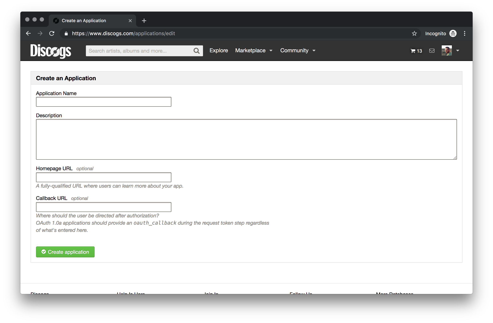
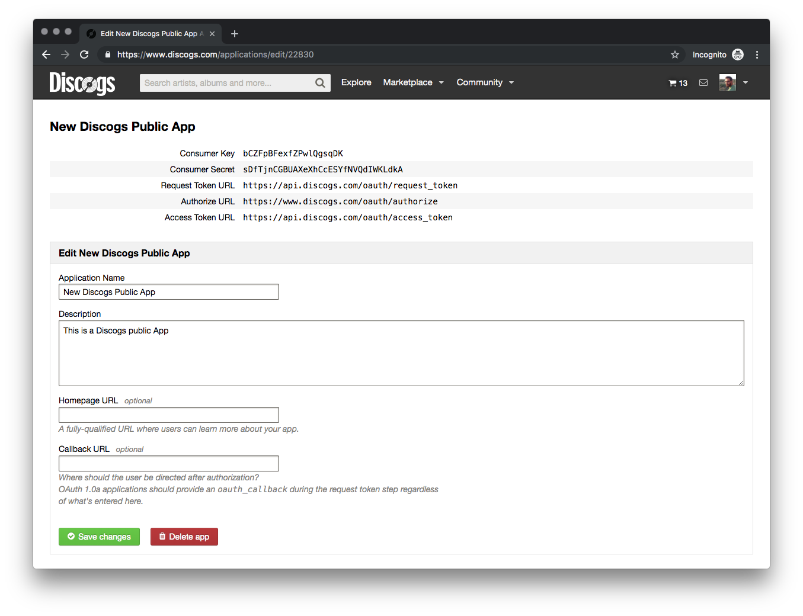
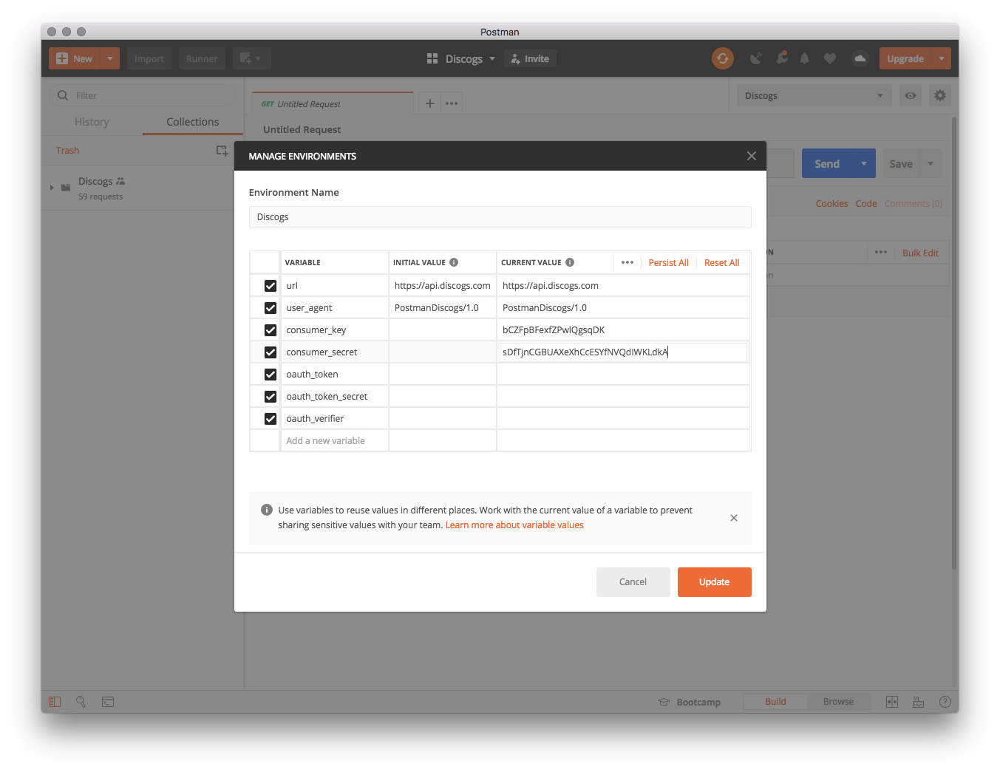
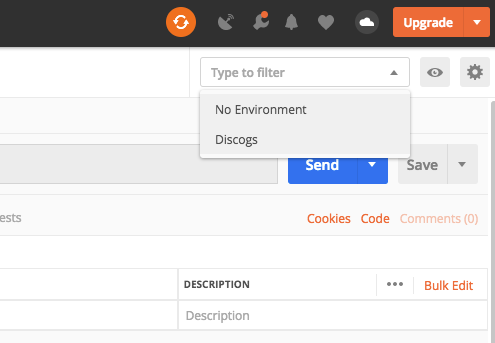
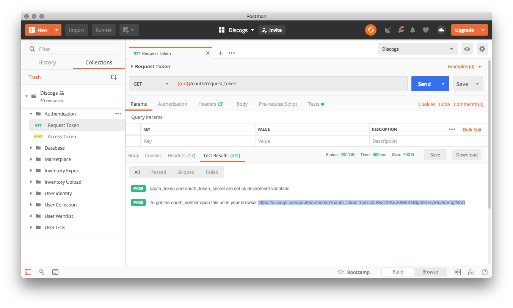
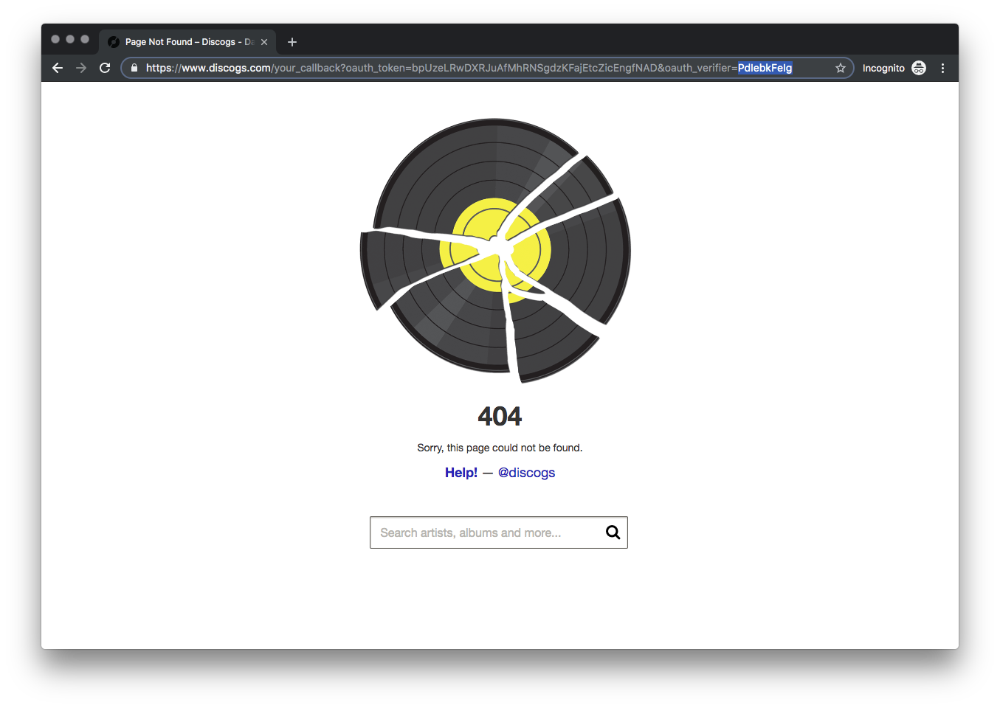
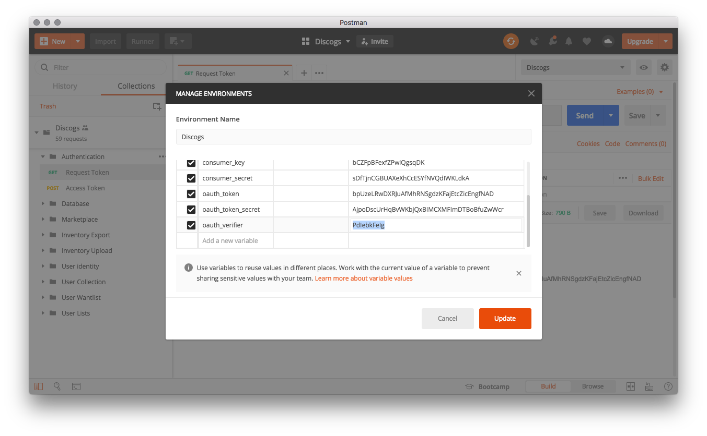
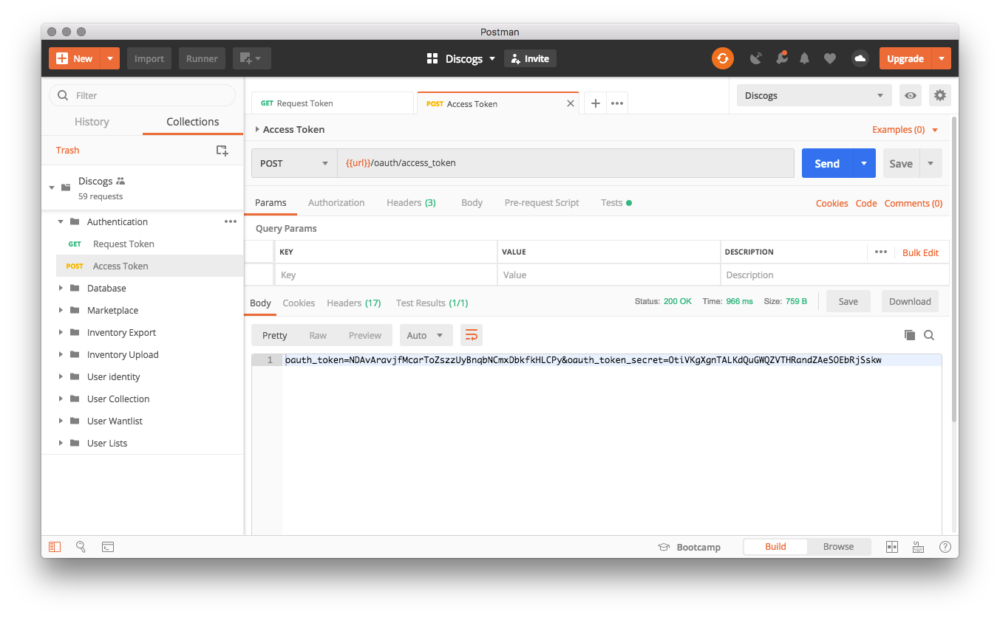

# Discogs Postman
A Postman collection for Discogs public API. 
## Steps to get up and running
Follow these steps to quickly get up and running with the Discogs public API and Postman:

### 1. Import the Discogs collection and environment into Postman
Download or clone this repository and import the collection and environment files. 

You can choose between the version 2.0 and 2.1. 

### 2. Create a public app at https://www.discogs.com/settings/developers
Go to the Discogs developer portal and create a public app.

### 3. Add your consumer key and consumer secret to the Discogs environment variables in Postman
Copy the consumer key and consumer secret of your app into the `consumer_key` and `consumer_secret` environment variables in Postman.

### 4. Select the Discogs environment
Select Discogs from the environment drop-down menu in Postman

### 5. Get your request token
Open the Authentication folder and send GET Request Token call in Postman. 

In the response section go to the Test Results tab and copy the authorization url.

### 6. Get your oauth verifier
Paste the authorization url into your browser, login to Discogs and authorize the application.

If the application doesn't have a valid callback url, you will be redirected to a 404 page. You find the `oauth_verifier` as last parameter of the webpage url, copy the value and paste it into the `oauth_verifier` environment variable in Postman.

### 7. Get your access token
Open the Authentication folder and send POST Access Token call in Postman. 

Congrats! You're now authenticated and can start making API calls.

### 8. Make your first API call!
Open the User identity folder and click Send on the GET Identity request to make your first API call.

## Discogs public API documentation
You find more informations regarding Discogs public APIs [here](https://www.discogs.com/developers/)

## Contibuting
Contribution are very welcome 
If you spot any bug, open a new issue or pull request.

## Licence
MIT
